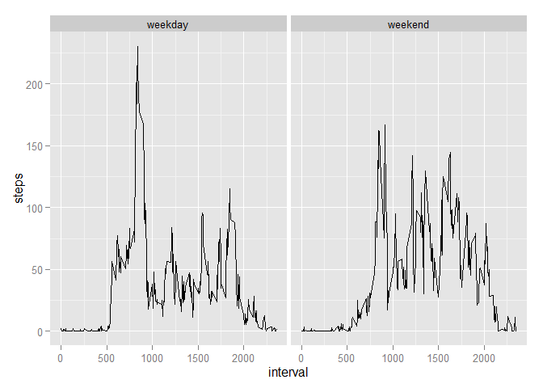

# Reproducible Research: Peer Assessment 1


## Loading and preprocessing the data

```r
##The working directory contains the zip file "activity.zip"
unzip("activity.zip")
data <- read.csv("activity.csv", colClasses = c("numeric", "character", "numeric"))
```

## What is mean total number of steps taken per day?


```r
library(dplyr)
```

```
## Warning: package 'dplyr' was built under R version 3.1.2
```

```
## 
## Attaching package: 'dplyr'
## 
## The following object is masked from 'package:stats':
## 
##     filter
## 
## The following objects are masked from 'package:base':
## 
##     intersect, setdiff, setequal, union
```

```r
##groups the data by date
data2 <- group_by(data, date)

##calculate total number of steps per day
stepsperday <- summarize(data2, sum(steps, na.rm=TRUE))
stepsperday
```

```
## Source: local data frame [61 x 2]
## 
##          date sum(steps, na.rm = TRUE)
## 1  2012-10-01                        0
## 2  2012-10-02                      126
## 3  2012-10-03                    11352
## 4  2012-10-04                    12116
## 5  2012-10-05                    13294
## 6  2012-10-06                    15420
## 7  2012-10-07                    11015
## 8  2012-10-08                        0
## 9  2012-10-09                    12811
## 10 2012-10-10                     9900
## 11 2012-10-11                    10304
## 12 2012-10-12                    17382
## 13 2012-10-13                    12426
## 14 2012-10-14                    15098
## 15 2012-10-15                    10139
## 16 2012-10-16                    15084
## 17 2012-10-17                    13452
## 18 2012-10-18                    10056
## 19 2012-10-19                    11829
## 20 2012-10-20                    10395
## 21 2012-10-21                     8821
## 22 2012-10-22                    13460
## 23 2012-10-23                     8918
## 24 2012-10-24                     8355
## 25 2012-10-25                     2492
## 26 2012-10-26                     6778
## 27 2012-10-27                    10119
## 28 2012-10-28                    11458
## 29 2012-10-29                     5018
## 30 2012-10-30                     9819
## 31 2012-10-31                    15414
## 32 2012-11-01                        0
## 33 2012-11-02                    10600
## 34 2012-11-03                    10571
## 35 2012-11-04                        0
## 36 2012-11-05                    10439
## 37 2012-11-06                     8334
## 38 2012-11-07                    12883
## 39 2012-11-08                     3219
## 40 2012-11-09                        0
## 41 2012-11-10                        0
## 42 2012-11-11                    12608
## 43 2012-11-12                    10765
## 44 2012-11-13                     7336
## 45 2012-11-14                        0
## 46 2012-11-15                       41
## 47 2012-11-16                     5441
## 48 2012-11-17                    14339
## 49 2012-11-18                    15110
## 50 2012-11-19                     8841
## 51 2012-11-20                     4472
## 52 2012-11-21                    12787
## 53 2012-11-22                    20427
## 54 2012-11-23                    21194
## 55 2012-11-24                    14478
## 56 2012-11-25                    11834
## 57 2012-11-26                    11162
## 58 2012-11-27                    13646
## 59 2012-11-28                    10183
## 60 2012-11-29                     7047
## 61 2012-11-30                        0
```

```r
##assigns a convenient column name to total number of steps 
colnames(stepsperday)[2] <- "steps"

## creates an hitstogram of total number of steps per day
hist(stepsperday$steps)
```

 

```r
##mean total number of steps taken per day
x <- mean(stepsperday$steps)
x
```

```
## [1] 9354.23
```

```r
## median of the total number of steps taken per day
y <- median(stepsperday$steps)
y
```

```
## [1] 10395
```
The mean number of steps taken per day is 9354.2295082. The median number of steps taken per day is 1.0395\times 10^{4}

## What is the average daily activity pattern?


```r
##calculate mean number of steps per 5-min interval averaged across all days
data3 <- group_by(data, interval)
stepsperinterval <- summarize (data3, mean(steps, na.rm = TRUE))

## plots the 5-minute interval (x-axis) and the average number of steps taken, averaged across all days (y-axis)
plot(stepsperinterval, type="l")
```

 


```r
## Finds which 5-minute interval, on average across all the days in the dataset, contains the maximum number of steps
colnames(stepsperinterval)[2] <- "stepsavg"
s <- max(stepsperinterval$stepsavg)
data4 <- filter(stepsperinterval, stepsavg == s)
data4
```

```
## Source: local data frame [1 x 2]
## 
##   interval stepsavg
## 1      835 206.1698
```

```r
z <- data4[1,1]
```
The interval 835 contains the maximum number of steps. 

## Imputing missing values


```r
## number of NAs for steps variable
n1 <- length(which(is.na(data$steps)))
n1
```

```
## [1] 2304
```
There are 2304 missing values in the dataset.

We will replace missing values by the mean number of steps across days for the corresponding interval.

The steps are as follow:

1) Merge the original dataset with the summary of mean number of steps across days for each interval.This way, each row will include the value observed on that particular interval for a particular day in the steps variable, as well as the mean number of steps across days for that particular interval in the stepsavg variable

2) Whevener a row contains NA in the steps column, it will be replaced by the value from the stepsavg column

3) The stepsavg column is removed, and columns and observations are re-ordered to match the original dataset.


```r
##adds a column containing the mean number of steps across days for corresponding interval to each row
data5 <- merge(data, stepsperinterval, by = "interval")
##NAs for the steps variable are replaced by mean value across day for corresponding interval
data5$steps[is.na(data5$steps)] <- data5$stepsavg[is.na(data5$steps)]
##creates a dataset equal to the original one, with missing data filled in.
data5 <- select(data5, -stepsavg)
data5 <- arrange(data5, date, interval)
data5 <- select(data5, steps, date, interval)
head(data5,20)
```

```
##        steps       date interval
## 1  1.7169811 2012-10-01        0
## 2  0.3396226 2012-10-01        5
## 3  0.1320755 2012-10-01       10
## 4  0.1509434 2012-10-01       15
## 5  0.0754717 2012-10-01       20
## 6  2.0943396 2012-10-01       25
## 7  0.5283019 2012-10-01       30
## 8  0.8679245 2012-10-01       35
## 9  0.0000000 2012-10-01       40
## 10 1.4716981 2012-10-01       45
## 11 0.3018868 2012-10-01       50
## 12 0.1320755 2012-10-01       55
## 13 0.3207547 2012-10-01      100
## 14 0.6792453 2012-10-01      105
## 15 0.1509434 2012-10-01      110
## 16 0.3396226 2012-10-01      115
## 17 0.0000000 2012-10-01      120
## 18 1.1132075 2012-10-01      125
## 19 1.8301887 2012-10-01      130
## 20 0.1698113 2012-10-01      135
```

```r
##checks that the dataset contains no NA
length(which(is.na(data5$steps)))
```

```
## [1] 0
```

We want to check the effect of these new values.

```r
##groups the data by date
data6 <- group_by(data5, date)

##calculate total number of steps per day
stepsperday2 <- summarize(data6, sum(steps, na.rm=TRUE))
stepsperday2
```

```
## Source: local data frame [61 x 2]
## 
##          date sum(steps, na.rm = TRUE)
## 1  2012-10-01                 10766.19
## 2  2012-10-02                   126.00
## 3  2012-10-03                 11352.00
## 4  2012-10-04                 12116.00
## 5  2012-10-05                 13294.00
## 6  2012-10-06                 15420.00
## 7  2012-10-07                 11015.00
## 8  2012-10-08                 10766.19
## 9  2012-10-09                 12811.00
## 10 2012-10-10                  9900.00
## 11 2012-10-11                 10304.00
## 12 2012-10-12                 17382.00
## 13 2012-10-13                 12426.00
## 14 2012-10-14                 15098.00
## 15 2012-10-15                 10139.00
## 16 2012-10-16                 15084.00
## 17 2012-10-17                 13452.00
## 18 2012-10-18                 10056.00
## 19 2012-10-19                 11829.00
## 20 2012-10-20                 10395.00
## 21 2012-10-21                  8821.00
## 22 2012-10-22                 13460.00
## 23 2012-10-23                  8918.00
## 24 2012-10-24                  8355.00
## 25 2012-10-25                  2492.00
## 26 2012-10-26                  6778.00
## 27 2012-10-27                 10119.00
## 28 2012-10-28                 11458.00
## 29 2012-10-29                  5018.00
## 30 2012-10-30                  9819.00
## 31 2012-10-31                 15414.00
## 32 2012-11-01                 10766.19
## 33 2012-11-02                 10600.00
## 34 2012-11-03                 10571.00
## 35 2012-11-04                 10766.19
## 36 2012-11-05                 10439.00
## 37 2012-11-06                  8334.00
## 38 2012-11-07                 12883.00
## 39 2012-11-08                  3219.00
## 40 2012-11-09                 10766.19
## 41 2012-11-10                 10766.19
## 42 2012-11-11                 12608.00
## 43 2012-11-12                 10765.00
## 44 2012-11-13                  7336.00
## 45 2012-11-14                 10766.19
## 46 2012-11-15                    41.00
## 47 2012-11-16                  5441.00
## 48 2012-11-17                 14339.00
## 49 2012-11-18                 15110.00
## 50 2012-11-19                  8841.00
## 51 2012-11-20                  4472.00
## 52 2012-11-21                 12787.00
## 53 2012-11-22                 20427.00
## 54 2012-11-23                 21194.00
## 55 2012-11-24                 14478.00
## 56 2012-11-25                 11834.00
## 57 2012-11-26                 11162.00
## 58 2012-11-27                 13646.00
## 59 2012-11-28                 10183.00
## 60 2012-11-29                  7047.00
## 61 2012-11-30                 10766.19
```

```r
##assigns a convenient column name to total number of steps 
colnames(stepsperday2)[2] <- "steps"

## creates an hitstogram of total number of steps per day
hist(stepsperday2$steps)
```

 

```r
##mean total number of steps taken per day
x2 <- mean(stepsperday2$steps)
x2
```

```
## [1] 10766.19
```

```r
## median of the total number of steps taken per day
y2 <- median(stepsperday2$steps)
y2
```

```
## [1] 10766.19
```
The mean number of steps taken per day with the new data is 1.0766189\times 10^{4}. The median number of steps taken per day with the new data is 1.0766189\times 10^{4}. This increases the mean of total number of steps taken per day, as well as the median (to a lesser extent). Interestingly, the mean and the median are now equal. If you are good at stats, maybe you can explain me that in the comments/feedback section?(Thanks!)

## Are there differences in activity patterns between weekdays and weekends?


```r
##takes the dataset with added data instead of NAs, and converts data into POSIXlt format
data5$date <- strptime(data5$date, format="%Y-%m-%d")

##creates the weekday column, containing a numeric value from 1(Monday) to 7(Sunday)
data5$weekday <- format(data5$date, format = "%u")
data5$weekday <- as.numeric(data5$weekday)

##Weekday values lesser than or equal to five are renamed "weekday"
data5$weekday[data5$weekday <= 5] <- "weekday"
##Remaining values ("6" and "7" are renamed "weekend")
data5$weekday[data5$weekday == "6"|data5$weekday == "7"] <- "weekend"
head(data5, 20)
```

```
##        steps       date interval weekday
## 1  1.7169811 2012-10-01        0 weekday
## 2  0.3396226 2012-10-01        5 weekday
## 3  0.1320755 2012-10-01       10 weekday
## 4  0.1509434 2012-10-01       15 weekday
## 5  0.0754717 2012-10-01       20 weekday
## 6  2.0943396 2012-10-01       25 weekday
## 7  0.5283019 2012-10-01       30 weekday
## 8  0.8679245 2012-10-01       35 weekday
## 9  0.0000000 2012-10-01       40 weekday
## 10 1.4716981 2012-10-01       45 weekday
## 11 0.3018868 2012-10-01       50 weekday
## 12 0.1320755 2012-10-01       55 weekday
## 13 0.3207547 2012-10-01      100 weekday
## 14 0.6792453 2012-10-01      105 weekday
## 15 0.1509434 2012-10-01      110 weekday
## 16 0.3396226 2012-10-01      115 weekday
## 17 0.0000000 2012-10-01      120 weekday
## 18 1.1132075 2012-10-01      125 weekday
## 19 1.8301887 2012-10-01      130 weekday
## 20 0.1698113 2012-10-01      135 weekday
```

```r
## values from column weekday are coerced into factors
data5$weekday <- as.factor(data5$weekday)
class(data5$weekday)
```

```
## [1] "factor"
```

In the next chunk of code, we want to mkake a panel plot containing a time series plot of the 5-minute interval (x-axis) and the average number of steps taken, averaged across all weekday days or weekend days (y-axis). 


```r
## removes the date column(POSIXlt objects somehow mess with filter(). Any idea why?)
data6 <- select(data5, -date)
data6 <- group_by(data6, weekday, interval)
data7 <- summarize(data6, mean(steps))
colnames(data7)[3] <- "steps"

## Uses qplot to plot 5 minutes interval vs avg of steps taken, for weekdays or week-end
## The format is slightly different from the example, but the graph presents the same info, same axes, and same panels.
library(ggplot2)
```

```
## Warning: package 'ggplot2' was built under R version 3.1.2
```

```r
qplot(x= interval, y= steps, data=data7,geom=c("line"),facets=.~weekday)        
```

 

